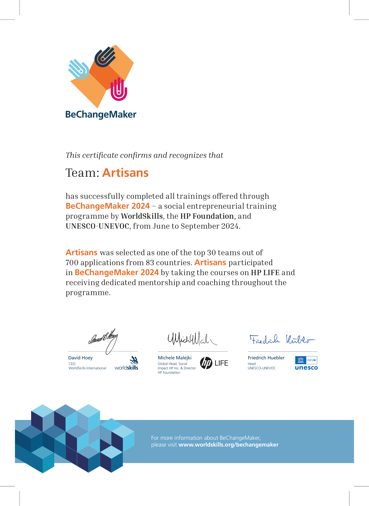

# MyArtisan

> **Note:** This repository contains an early, incomplete version of an older project (the final production version was built with Inertia.js and hosted in a separate, private repository). To evaluate my current coding standards and enterprise PHP architecture (MVC, OOP), please check out my latest project: [Typo3Festivo](https://github.com/YoussefLahbari/Typo3Festivo)
 
**Top 30 Global Finalist — BeChangeMaker 2024**  
*Selected out of 700+ applications across 83 countries in the social entrepreneurship program organized by WorldSkills, HP Foundation, and UNESCO-UNEVOC.*

---

## Overview

MyArtisan is a web application designed to connect independent artisans with local clients. In many regions, skilled trade workers rely strictly on word-of-mouth or local ads to find work. MyArtisan modernizes this process by providing a centralized marketplace where clients can discover, communicate with, and hire qualified artisans for specific tasks.

---

## Core Features

- **Artisan & Client Portals:** Profiles for artisans showcasing skills, experience, and service categories, alongside dedicated client search features.
- **Service Search & Filtering:** Location- and category-based filtering for home tasks, repairs, mounting, and maintenance.
- **Real-Time Messaging:** Integrated direct chat system (Chatify) enabling direct communication between clients and artisans to discuss scope and pricing.
- **Admin Management:** Backend administration interface to oversee user accounts, manage service categories, and monitor platform activity.

---

## Technical Stack

- **Backend:** PHP / Laravel (MVC Architecture)
- **Frontend:** HTML5, CSS3, JavaScript, Tailwind CSS / Blade
- **Database:** MySQL (Relational Schema: Users, Artisans, Services, Reviews, Locations)
- **Communication:** Real-time chat integration (Chatify)

---

## Recognition & Certification

This project was developed as a capstone initiative and was selected for the **BeChangeMaker 2024** incubation program, receiving dedicated business development and tech coaching from HP and WorldSkills mentors.

